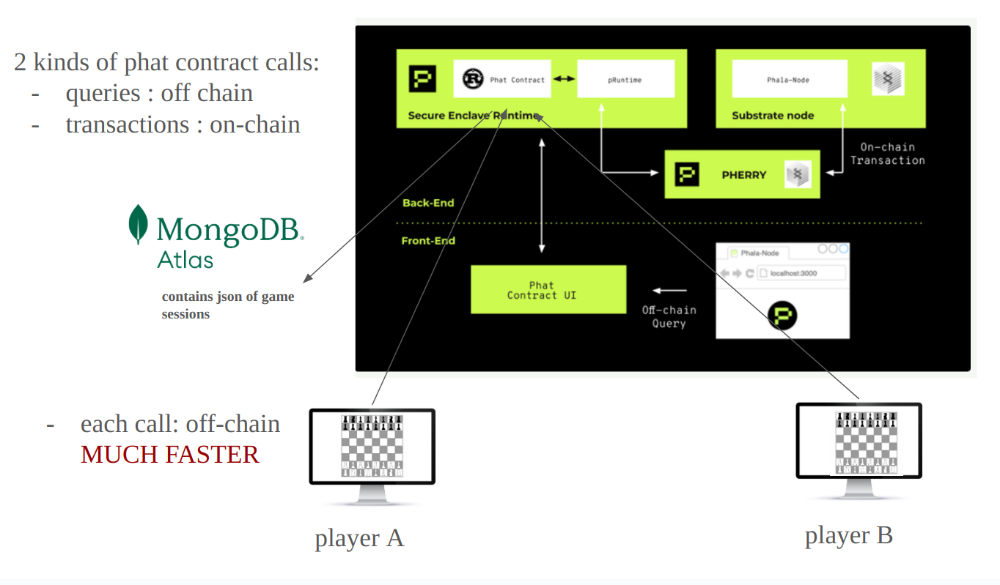

# Hackathon Polkadot Encode 2024 Q1: Chess on Phala Network

This project implements a chess game on the Phala Network, utilizing off-chain computations to handle chess moves. This approach significantly enhances efficiency by avoiding on-chain transactions for every player move.



## Resources

For a more detailed explanation and walkthrough of the project, please refer to the following resources:

- **Video Explanation**: Watch this [short video](https://youtu.be/47hifdI5jlY) to get an overview of the project and see it in action.
- **Presentation Slides**: Access the [slides](https://docs.google.com/presentation/d/1YSu6sMPP1880jwRfbA_2bX7pHBZ5BN46NN_ecu6gEdw/edit?usp=sharing) used in the video for more detailed information and step-by-step instructions.


## Prerequisites

Before you begin, ensure the following tools are installed on your system:

- **Yarn**: This project relies on Yarn for dependency installation because it provides better reliability and performance compared to npm/npx for this specific workflow.
- **Cargo**: The Rust package manager, required for compiling Rust contracts and running the node.
- **Node.js**: Version 18 or higher is required for compatibility with the development tools used in this project.

## Installation and Local Testing

Follow these steps to install dependencies and set up your local environment:

1. Install project dependencies:
    ```bash
    yarn install
    ```
   **Note**: It's crucial to use Yarn for the installation to ensure proper dependencies are installed. Subsequent commands can be executed using npm/npx.

2. Start the Phala node:
    ```bash
    npx devphase stack run --save-logs
    ```
   Keep this running in one terminal window.

3. In a new terminal window, set up the Phala stack:
    ```bash
    npx devphase stack setup -m 3
    ```
   Note: This process might take longer than usual.

4. Compile the smart contracts:
    ```bash
    npx devphase contract compile -c oh_my_chess
    ```

5. Deploy the Phat contract on the local network:
    ```bash
    npx devphase contract deploy -n local -c oh_my_chess -o new -l 0x0000000000000000000000000000000000000000000000000000000000000001
    ```
   Replace `<CLUSTER_ID>` with `0x0000000000000000000000000000000000000000000000000000000000000001`. This command will deploy the Phat contract and return its address, denoted as `<PHAT_CONTRACT_ADDRESS>`.

**Important**: Interact with the Phat contract using scripts, as the contract methods require parameters.

## More Information

For more details about the Phala Network, visit the [official website](https://phala.network/).

For documentation regarding the Devphase CLI, refer to the [Devphase Documentation](https://github.com/l00k/devphase/blob/master/docs/usage.md).
